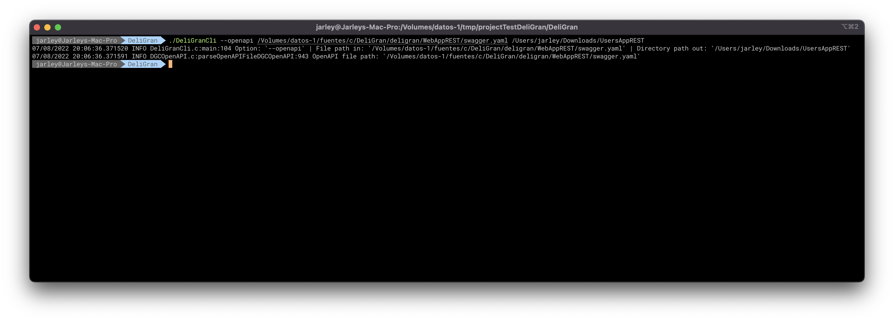
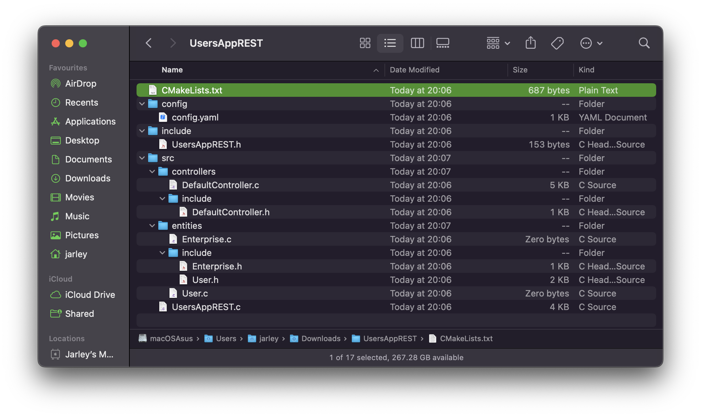
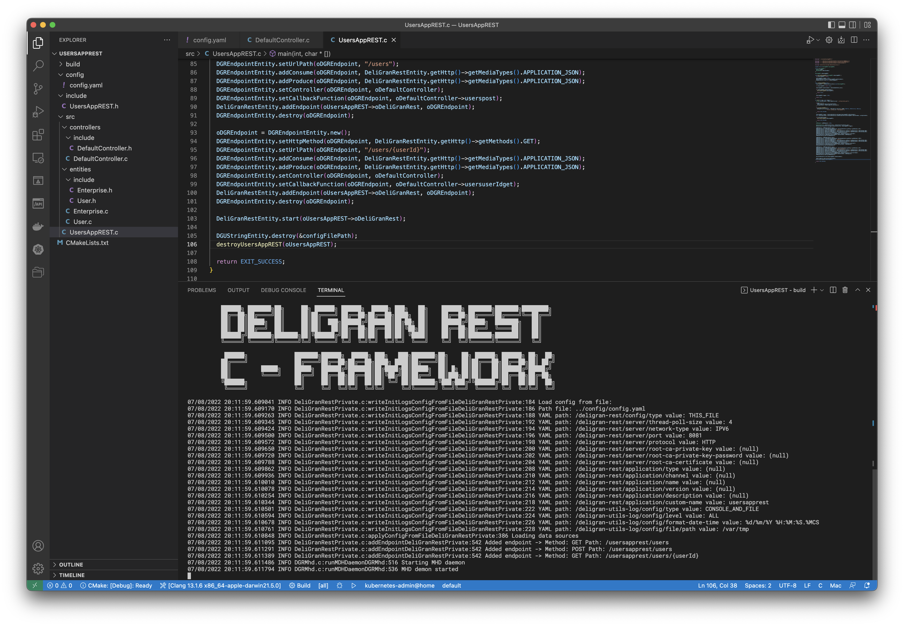
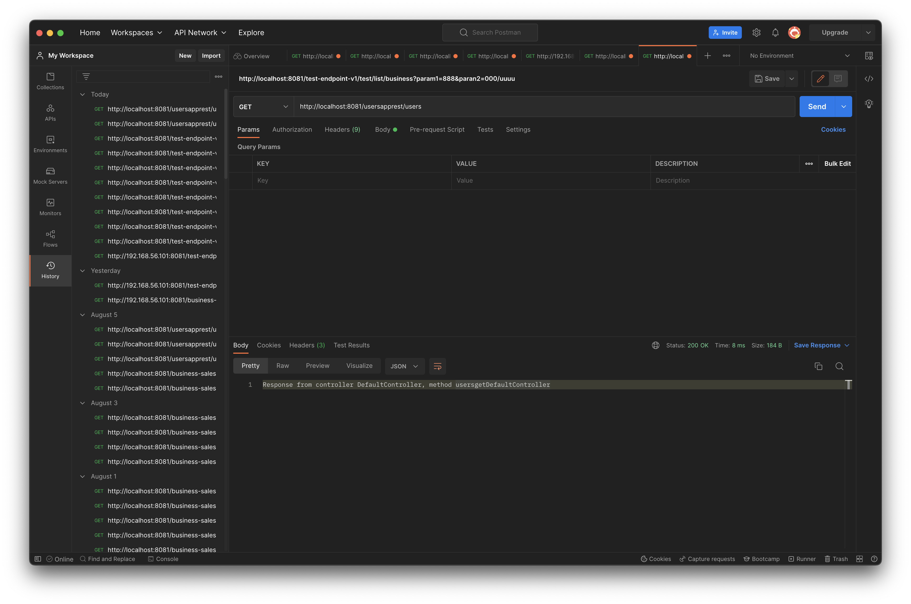

# DeliGran
C Framework para aplicaciones REST

--> [Official documentation](https://jarley91.github.io)

DeliGran se basa y usa lo siguiente:

- [GNU Libmicrohttpd](https://www.gnu.org/software/libmicrohttpd/)
- [The GnuTLS Transport Layer Security Library](https://www.gnutls.org/)
- [SDS - Simple Dynamic Strings](https://github.com/antirez/sds)
- [libfyaml](https://github.com/pantoniou/libfyaml)
- [hashdict.c](https://github.com/exebook/hashdict.c)
- [ulfius](https://github.com/babelouest/ulfius)

Cada implementación siempre está hecha simple y sencilla dentro de un ecosistema puro en **C**, esto con el fin de que sea un producto fácil de usar e implementar, pero sin perder la solidez y robustez que brinda **C**

## Lo implementado:
- Configuración en base a un archivo o texto YAML/JSON
- Servidor HTTP y HTTPS
- Logger
- Endpoints
- Implementación de Controlador
- Integración YAML/JSON
- Integración OpenAPI
- Nano ORM

## A implementar:
- Integración con un servidor de configuración
- Niveles de logs, control de archivos generados
- Encriptar datos sensibles
- OAuth 2.0
- Integración con Kubernetes
- Integración con REDIS
- Iré agregando más ...

## Empecemos:

Lo necesario para inciar está en la carpeta bins para Linux y macOS

**DeliGranCli**

Crea y diseña tu archivo YAML/JSON con la especificación OpenAPI, con lo cual puedes crear tu proyecto con **DeliGranCli**

```shell
./DeliGranCli --openapi /path/to/OpenAPI.yaml /path/to/DirProject
```

**DirProject** será el nombre de tu proyecto




**Listo, usa tu IDE preferido para C con CMake, en mi caso uso vscode o xCode, puedes usar tambie, Qt-Creator**


